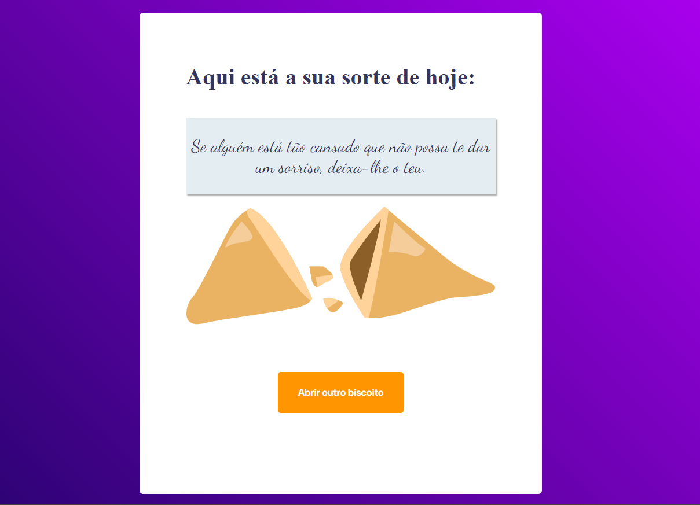

 <h1 align="left">Desafio Biscoito da sorte</h1>

###

Esse projeto foi utilizado os princípios de constantes no JavaScript e Funções

###

<h1 align="left">Techs</h1>

###

  
  
  
  
  

###

  

